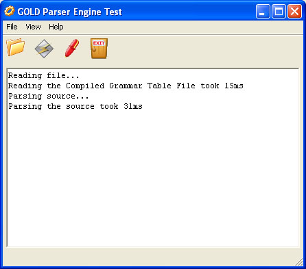

# Calitha C# GOLD Parser Engine

- Platform: .NET 2.0
- License: [MIT License](http://www.opensource.org/licenses/mit-license.html)

This project can be used to parse (LALR) text and construct a parse tree that can be traversed in an object-oriented manner. It can therefore be embedded in your software product. All you need is the GOLD Parser Builder from the [GOLD Parser website](http://www.goldparser.org/) to construct a grammer and create a compiled grammar table which can be loaded into the Calitha C# GOLD Parser Engine.

Includes two sample project. One is a test project to load (compiled) grammars and test them with your input. The other is a Text Calculator which can parse and evaluate simple mathematical expressions, and is used to demonstrate how to use the parser in your own application. 

## Screenshots

## History

- 1.14 - Fixed bug related to line comments and linefeeds.
- 1.13 - Fixed bug related to nested comments.
- 1.12 - Improved error recovery, including the ability to insert tokens. New event for line and block comments. Extract comment with or without comment tokens. Fix in Text Calculator to always use '.' as decimal character.
- 1.11 - Fix in line comments. Test project fixes: Show escape character in tokenize steps. Show dialog for source file errors.
- 1.10 - Performance improvement.
- 1.9 - Included templates and "Text Calculator" example project. Ability to abort parse during token read and reduction events. Parse mode to free stored tokens to conserve memory. Reorder files in namespaces. TokenReadEvent is optional again.
- 1.8 - Ability to set user object in reductions. Performance improvement when using large character sets. Font selection in test project. Making user selections persistent between application sessions. File source browsing and UTF-16 Little Endian BOM detection. Uses ndoc for documentation generation.
- 1.7 - Error recovery when a tokenize or parsing error occurs. Allows for continuing after an error and insert a new token in the process.
- 1.6 - Corrected camel/pascal case mistake in creation methods. Includes strongly signed binaries. Source includes different general purpose test key for building StronglyNamedAssembly solution.
- 1.5 - Supports fast multi-threaded creation of tokenizers and parsers. Small GUI fix.
- 1.4 - Id (table index) for symbol and rule objects. Makes it easier and faster to use GOLD Parser Builder generated constants in reduction.
- 1.3 - Public symbols.
- 1.2 - Trimreductions support.
- 1.1 - Multiline bugfix and code cleanup.
- 1.0 - Initial release.

